

  

<h1 align="center">ESPsoup</h1>

<b>Scoop signals from the frequency soup.</b> 
A receive-only radio scanner app for the ESP32-C5 — Android, Windows and the browser.

<i>🍲 Public beta 0.1 (app 0.12.3) · <a href="https://github.com/pit711/ESPsoup/releases/latest">Android APK</a> · <a href="https://app.espsoup.com/">web app</a> · Windows app coming soon.</i>

  
  
  
  

---

The air around you is a soup of radio signals. ESPsoup turns a cheap **ESP32-C5** board, plugged into your phone or PC by USB,
into a pocket spectrum scanner for the **2.4 GHz and 5 GHz bands**. It shows what's cooking and scoops out whatever it can decode —
Bluetooth, Wi-Fi, Zigbee, Thread, drones, mobile cells, cars (ITS-G5) and live analog FPV video on its own little TV.
Everything is decoded locally on your device, and ESPsoup never transmits.

## Four tabs, two or three taps

The 0.12 interface has four areas. Every function is at most two or three taps away.

| Tab | What's in it |
|---|---|
| **Scan** | Type a signal type (*ELRS*, *AirTag*, *HDZero* …) and search it in one tap — or tap ingredients and hit **Search ingredients (n)**, or just **Search everything**. Every find has **Find** and ▶. |
| **Spectrum** | Live spectrum and waterfall. Type a frequency like in SDR software — `2437`, `5.8G`, `2437.5`. Frequencies the chip can't reach are marked, with the reason and the nearest receivable one. |
| **Tools** | **TV**, Panorama (live, with its own start/stop), Wi-Fi channels (now and over 24 h), Find on any frequency with a GPS heatmap, Burst catcher, Map, Recordings, Identify. |
| **Device** | Firmware flasher (backup first, every write verified), calibration, second board, notifications, MQTT export, settings. |

### Scan

| Ingredients | Signal-type search | Finds |
|---|---|---|
| 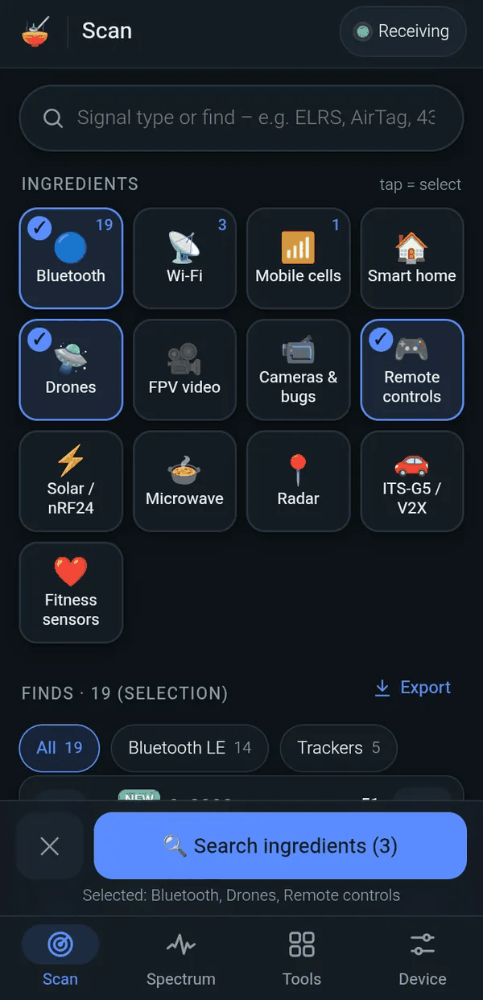 | 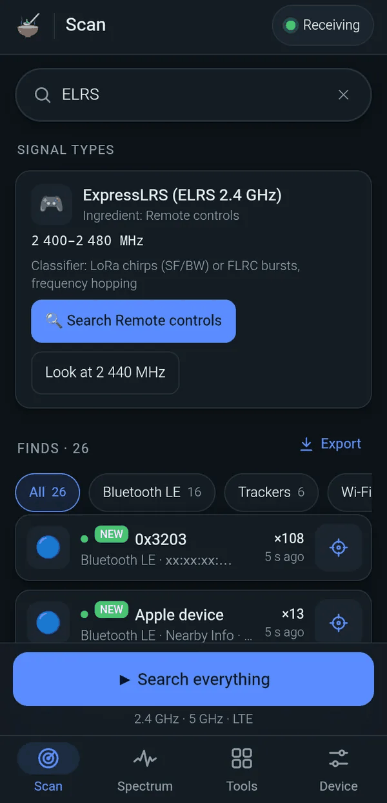 | 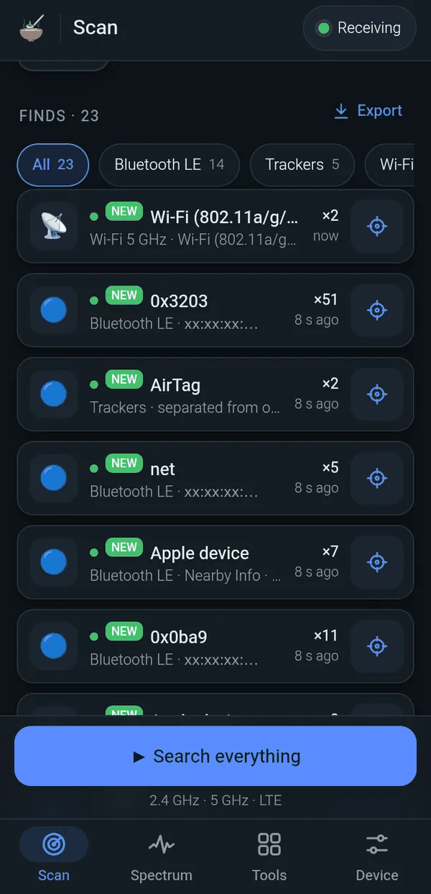 |
| *Tap ingredients → “Search ingredients (3)”* | *Type “ELRS” — band, classifier, one-tap search* | *Wi-Fi, Bluetooth, trackers — each with Find* |

### Spectrum and Tools

| Type a frequency | Honest tuning | Panorama |
|---|---|---|
| 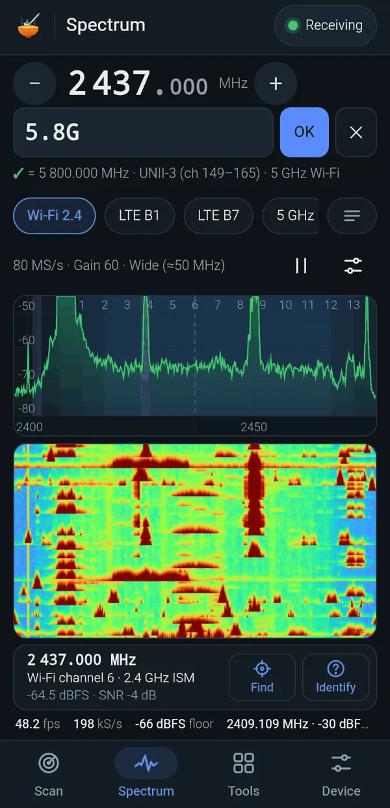 | 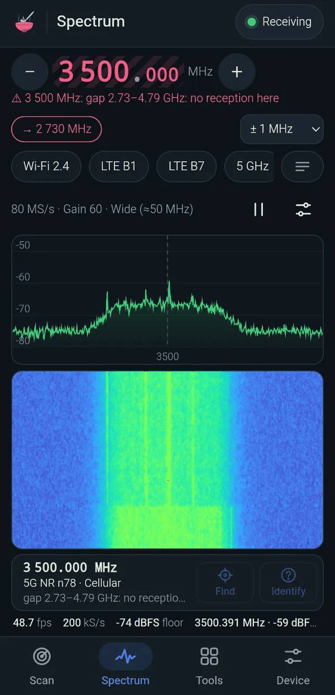 | 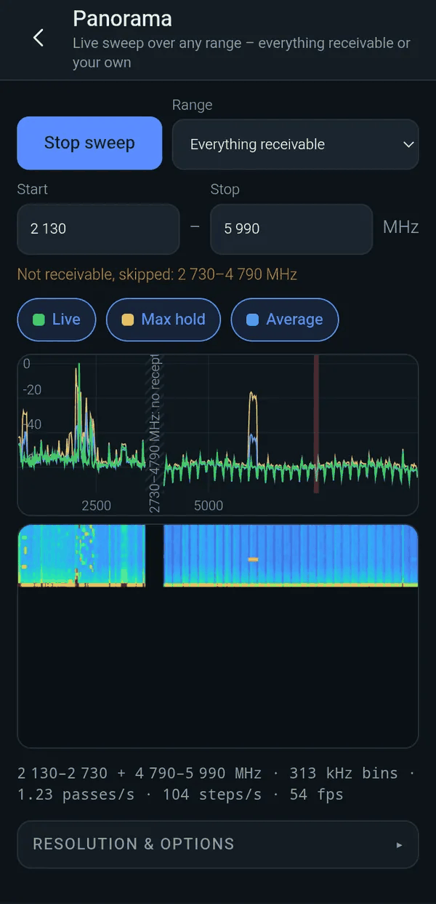 |
| *`5.8G` → 5800 MHz, UNII-3* | *3500 MHz is in the chip's gap — marked, with the nearest frequency* | *Live sweep over everything receivable* |

| Tools | Find (hot/cold) | Wi-Fi channels |
|---|---|---|
| 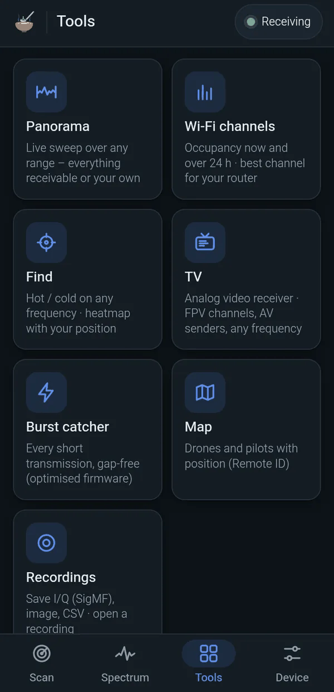 | 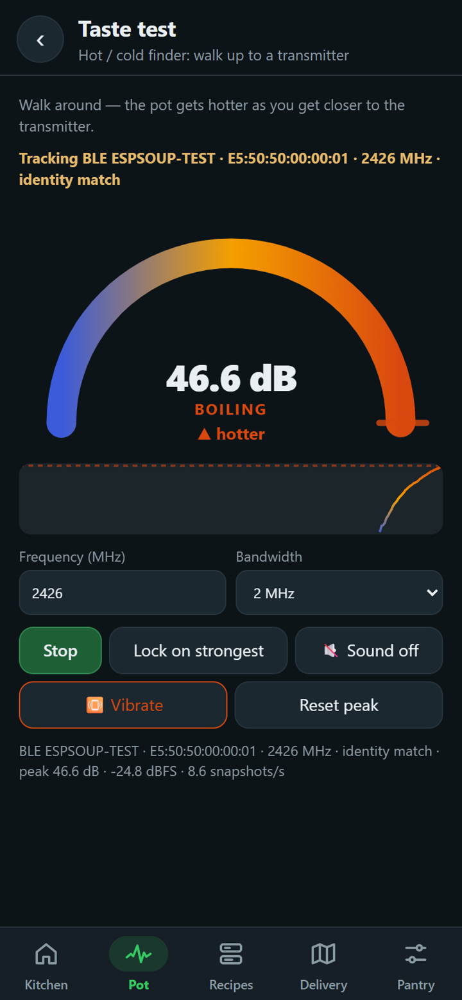 | 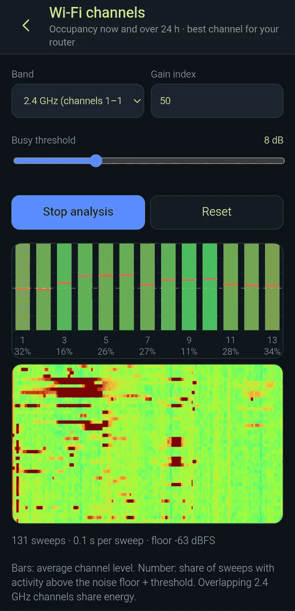 |
| *TV, Panorama, Find, Burst catcher, Map, Recordings* | *Walk around — the pot gets hotter as you get closer* | *Occupancy now and over 24 h* |

| Identify | Light theme | Measuring tip |
|---|---|---|
| 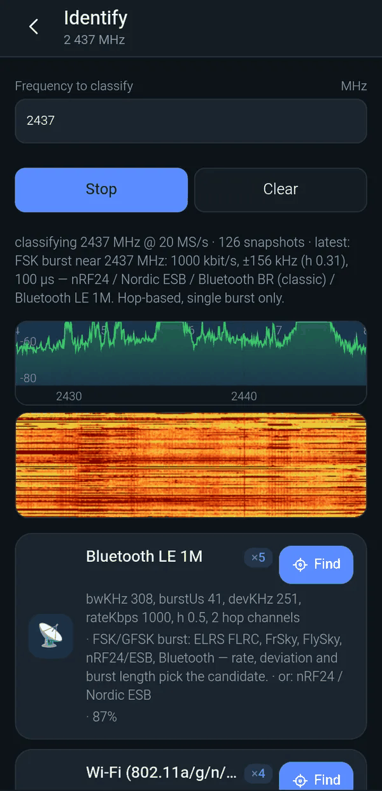 | 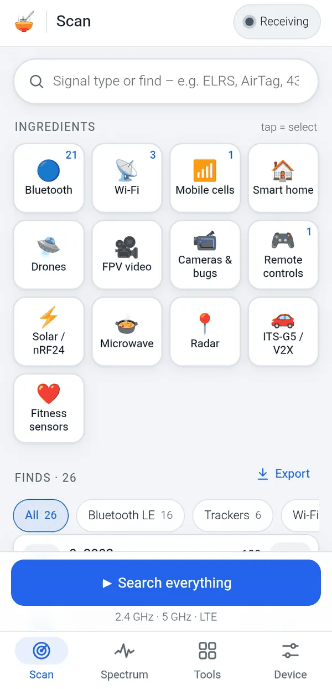 | 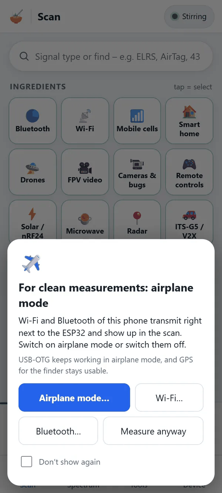 |
| *“What is this?” — classifier on any frequency* | *Light and dark* | *Airplane mode before measuring* |

## 📺 ESPsoup TV

**Tools → TV** is an analog video receiver. Pick a channel table — **Raceband, Fatshark, Boscam A / B / E, Lowband, 2.4 GHz AV** —
or type any frequency. The picture starts at once (snow when there's nothing on air), with PAL / NTSC / auto,
channel ◀ ▶, seek, an auto cycle with adjustable interval and *stop on a picture*, and fullscreen.

| Raceband R5 | No signal = snow | Any frequency |
|---|---|---|
| 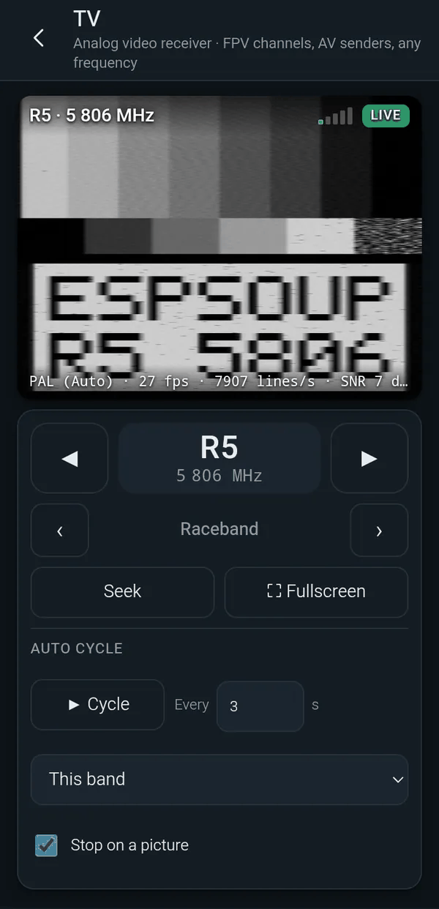 | 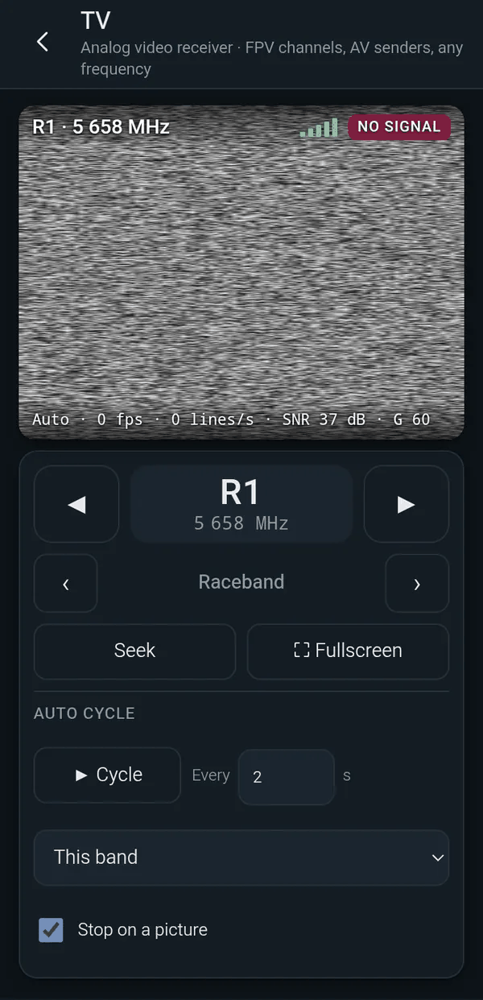 | 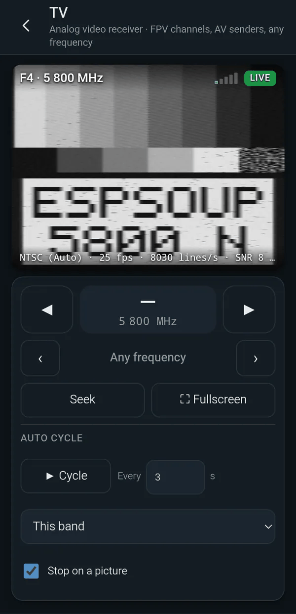 |
| *5806 MHz, PAL, ~25 fps* | *Picture right away, even without a sender* | *5800 MHz typed in, NTSC detected* |

| 2.4 GHz AV sender | Switching channels | Colour (rough) |
|---|---|---|
| 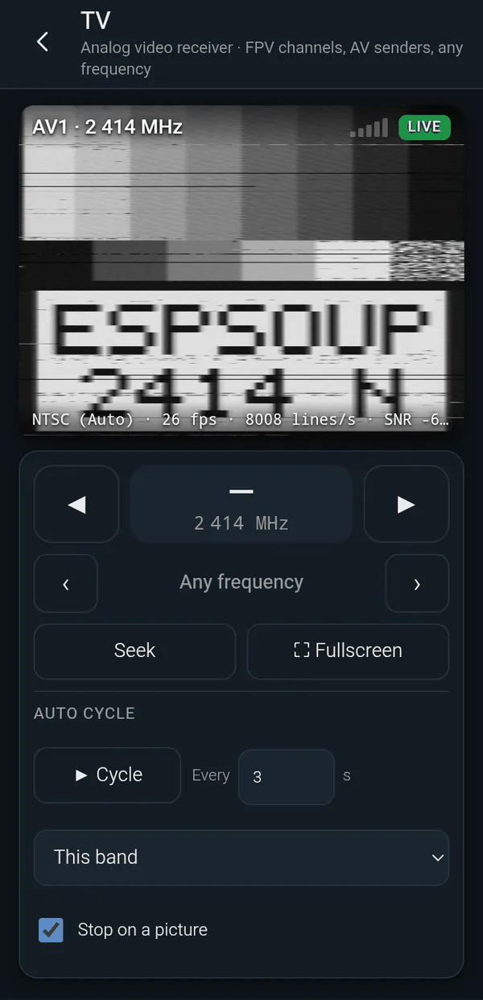 | 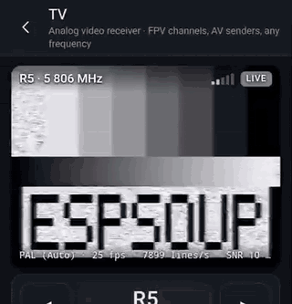 | 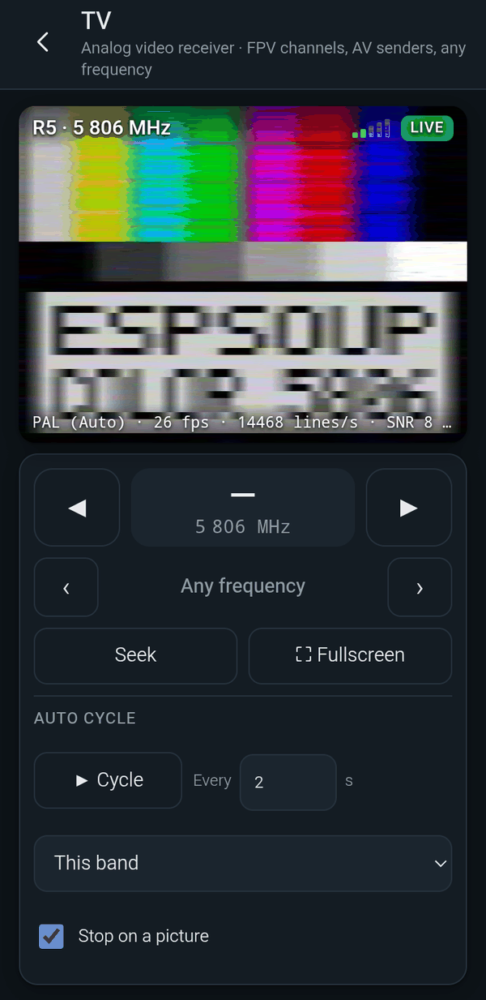 |
| *AV1, 2414 MHz* | *R5 → R6 (empty) → R5* | *PAL colour bars, ESPsoup firmware* |

| Colour in fullscreen | Live video, 2.4 GHz AV |
|---|---|
| 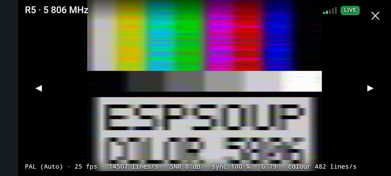 | 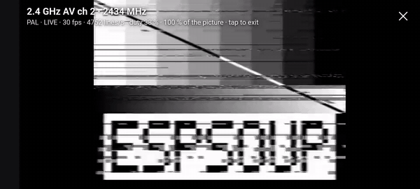 |
| *Rough PAL colour — NTSC works too* | *2434 MHz, demodulated on the ESP32 itself* |

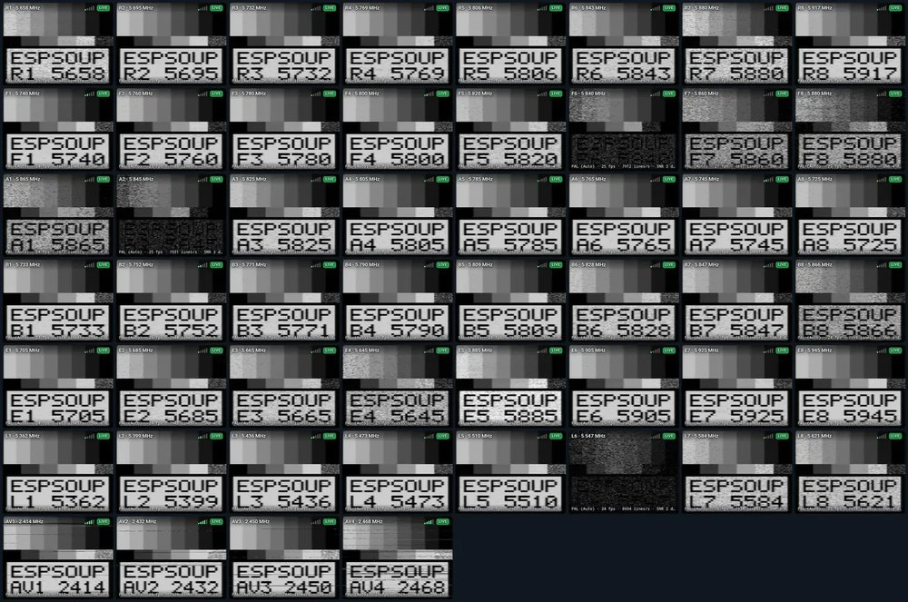

*All 52 receivable channels with a picture: Raceband, Fatshark, Boscam A/B/E, Lowband (5362–5945 MHz) and 2.4 GHz AV (2414–2468 MHz).*

**Tested with a lab signal generator:** 52 of 52 receivable channels gave a picture, about **25 frames/s** and **~7,900 lines/s**.
The ESP32 demodulates the video itself (ESPsoup firmware 0.7.1), in black and white or with rough colour (PAL and NTSC).
The 1.2/1.3 GHz FPV band can't be received by the ESP32-C5, and digital systems (DJI, HDZero, Walksnail) are only recognised, without a picture.

Phone screenshots from an Android phone with an ESP32-C5 on USB-OTG. Test pictures came from an ADALM-PLUTO signal generator;
addresses of real neighbours are masked, and no map or heatmap of a real location is shown.

## What works, what partly works, what doesn't

The ESP32-C5 is a Wi-Fi chip, not a lab SDR. This is what ESPsoup really does with it — tested on real air and,
where there was nothing on air to test with (video, RC links, ITS-G5), with an ADALM-PLUTO signal generator (October 2026).

✅ works · ◐ partly (recognised, but not fully decoded or not reliable yet) · ❌ not possible

| | Signal / feature | Frequency | Notes |
|---|---|---|---|
| | **Spectrum and tools** | | |
| ✅ | Live spectrum, waterfall, frequency entry | 2.13–2.73 · 4.79–5.99 GHz | Up to 80 MHz wide; unreachable frequencies are refused with the reason |
| ✅ | Panorama live, own start/stop | any receivable range | About 15 sweeps/s over 2.4 GHz; gaps are skipped |
| ✅ | Find (hot/cold) with GPS heatmap | any receivable frequency | Usable over about 25–30 dB; the heatmap stays on your device |
| ✅ | Gap-free reception, burst catcher | same ranges | |
| | **Bluetooth** | | |
| ✅ | BLE advertising: names, sensors (BTHome, Xiaomi, Govee, Ruuvi), iBeacon, Eddystone | 2402 · 2426 · 2480 MHz | |
| ✅ | AirTag and tracker warning | 2.4 GHz | AirTag, SmartTag, Tile, Google trackers — warns if one keeps showing up around you |
| ✅ | BLE 2M and extended advertising | 2.4 GHz | |
| ✅ | Bluetooth packet catcher, 60–120 packets/s | 2.4 GHz | Demodulated on the chip |
| ◐ | BLE Coded (Long Range) | 2.4 GHz | Seen in the spectrum, not decoded yet |
| ◐ | Bluetooth Classic | 2.4 GHz | Recognised by its hopping pattern, not decoded |
| | **Wi-Fi and cars** | | |
| ✅ | Wi-Fi 802.11b/g/a (incl. 5 GHz OFDM): network names from beacons | 2.4 · 5 GHz | Including the channels above 5.75 GHz |
| ✅ | ESP-NOW, searching phones (anonymous count), deauth alarm | 2.4 GHz | |
| ✅ | Wi-Fi channel occupancy | 2.4 · 5 GHz | Now and over 24 hours |
| ✅ | ITS-G5 / 802.11p (car-to-car V2X) | 5.855–5.925 GHz | |
| | **Smart home and sensors** | | |
| ✅ | Zigbee, Zigbee Green Power, Thread (802.15.4) | 2405–2480 MHz | |
| ✅ | nRF24, Hoymiles solar inverters | 2.4 GHz | |
| ✅ | ANT+ fitness sensors | 2457 MHz | |
| ✅ | Microwave oven | ≈ 2.45 GHz | Recognised while it runs |
| | **Drones and remote controls** | | |
| ✅ | Drone Remote ID (Bluetooth, Wi-Fi beacon, Wi-Fi NAN) | 2.4 · 5 GHz | Drone and pilot position on the map |
| ◐ | RC links: ExpressLRS, FLRC, Ghost, Tracer, FrSky, FlySky, DSMX, LoRa 2.4 | 2.4 GHz | Recognised by the classifier; exact link type sometimes unsure; control data not decoded |
| ◐ | DJI drones (OcuSync, DroneID) | 2.4 · 5.8 GHz | Video link recognised; DroneID not detected over the air yet |
| | **Video** | | |
| ✅ | ESPsoup TV: Raceband, Fatshark, Boscam A/B/E, Lowband, 2.4 GHz AV or any frequency | 5362–5945 · 2414–2468 MHz | 52 of 52 channels with a picture, ~25 fps; seek, auto cycle, fullscreen |
| ◐ | Colour in the TV picture (PAL / NTSC) | same | Rough colour; black and white is the reliable default |
| ✅ | Analog FPV video and 2.4 GHz wireless cameras, live | 5.36–5.95 · 2.41–2.47 GHz | Demodulated on the ESP32 |
| ◐ | Digital video: HDZero, Walksnail, OcuSync, DVB-T senders | 2.4 · 5.8 GHz | Recognised, but no picture — digital video is too much for the ESP32 |
| | **Mobile network and the rest** | | |
| ◐ | LTE / 5G NR cell identities | bands 1 and 7 (2.11–2.17 · 2.62–2.69 GHz) | Depends on your surroundings; also calibrates the board's crystal |
| ✅ | Radar, FMCW, CW and NBFM carriers | 2.4 · 5 GHz | Recognised by their shape; nothing to decode |
| | **Not possible with the ESP32-C5** | | |
| ❌ | FM, DAB+, 433/868 MHz sensors, LoRa below 1 GHz, 1.2/1.3 GHz FPV, ADS-B, GPS, DECT, LTE bands 3/8/20 | below 2.1 GHz | The chip can't tune there |
| ❌ | 5G n78 (3.5 GHz), C-band | 2.75–4.79 GHz | A gap in the tuning range |
| ❌ | Wi-Fi 6E, 10 GHz, QO-100 | above 6 GHz | The radio ends below 6 GHz |
| ❌ | Calls, audio, message contents | – | By design: ESPsoup only shows public broadcast information |

**Bottom line:** a good 2.4/5 GHz scanner and decoder for about **2.13–2.73 GHz and 4.79–5.99 GHz** — with live analog video, drone Remote ID and LTE/5G cell identities. It is not a broadband SDR.

> **Measuring?** Put your phone in **airplane mode**, or at least switch off its Wi-Fi and Bluetooth — they transmit a few centimetres
> from the ESP32 and would be the loudest ingredient in the soup. USB-OTG and GPS keep working. The app reminds you.

## Firmware

ESPsoup needs the **[ESPsoup firmware 0.7.1](https://github.com/pit711/espsoup-firmware/releases/tag/v0.7.1)** on the board —
open source under GPL-3.0, a fork of the **[ESP-SDR firmware by ESPARGOS](https://github.com/ESPARGOS/esp-sdr)**, which turns the
ESP32-C5's Wi-Fi radio into an I/Q receiver. Both the Android app and the browser app ship it: **Device → Firmware** backs up the board first,
flashes and verifies every image. Compared with ESP-SDR it adds:

- **gap-free reception** instead of snapshots (burst catcher, packet catcher),
- the **5.9 GHz extension** up to 5990 MHz (upper 5.8 GHz band, ITS-G5),
- **video and Bluetooth demodulation on the chip** — that's what makes the live TV at ~25 frames/s possible.

## Coming next

- **Windows app** — coming soon. Android: [beta APK](https://github.com/pit711/ESPsoup/releases/latest); browser: [app.espsoup.com](https://app.espsoup.com/).
- **Dual TV / diversity** with two boards — experimental, tested on the same channel so far.
- Better colour in the TV picture.
- Decoding BLE Long Range and DJI DroneID, surer identification of RC links.

## What you need

Any **ESP32-C5** board works — it is the only ESP32 with the 5 GHz radio ESPsoup needs. Three boards we test with:

|  |  |  |
|:---:|:---:|:---:|
| **Dev board + antenna connector** ⭐ | **Mini · Seeed XIAO ESP32-C5** | **Dev board, PCB antenna** |
| ESP32-C5-WROOM-1U with U.FL — best reception, room for a better 2.4/5 GHz antenna | thumb-sized, U.FL connector — great as a second board | simplest option, fine for the 2.4/5 GHz recipes |
| [View on Amazon](https://www.amazon.de/dp/B0GXVF2MWX?tag=v2x2map-21) | [View on Amazon](https://www.amazon.de/dp/B0HCVKT7GX?tag=v2x2map-21) | [View on Amazon](https://www.amazon.de/dp/B0G2SFD8ZC?tag=v2x2map-21) |

Affiliate links (ad). As an Amazon Associate I earn from qualifying purchases — it costs you nothing extra and keeps the soup cooking.
Product photos come from Amazon.

Also needed:
- A USB-C data cable — plug into the board's **native USB** port, not the UART bridge port (CH340 etc.), which is too slow. On Android, a USB-OTG cable or adapter that carries data.
- The ESPsoup firmware 0.7.1 — the app installs it for you, see [Firmware](#firmware).
- On the PC: Chrome, Edge or another Chromium browser (Web Serial).

## Support

ESPsoup is a hobby project. If you like it, a small tip pays for test boards, antennas and coffee:

- ☕ **Ko-fi:** https://ko-fi.com/711it
- 💸 **PayPal:** https://paypal.me/711IT

## Credits

ESPsoup stands on the shoulders of these projects — thank you!

- **[ESPARGOS ESP-SDR](https://github.com/ESPARGOS/esp-sdr)** (GPL-3.0-or-later) — the I/Q receiver firmware for ESP32 chips that everything here builds on.
  The ESPsoup firmware is a fork of it; its hardware DC calibration is ported from ESP-SDR's ESP32-S31 streaming code.
- **[C5VRX](https://github.com/konradit/C5VRX)** by konradit (GPL-3.0-only) — the idea of the gap-free capture path
  (modem diagnostic bus → GPIO loopback → PARLIO → circular DMA) and a tuning experiment (`phy_set_freq`). ESPsoup's implementation is
  independent; no C5VRX code was copied (see the firmware's NOTICE).
- **[FutureSDR](https://github.com/FutureSDR/FutureSDR)** (Apache-2.0) — the 802.11a/g/p OFDM receiver in the app is ported from its WLAN example.
- Formats and tables from **bthome-ble**, **xiaomi-ble**, **ble_monitor**, **ruuvitag-sensor**, **AirGuard** (SEEMOO / TU Darmstadt),
  **OpenThread**, **zigbee-herdsman**, **classg**, **ESP-NOW** and others — full list with licences in [THIRD_PARTY.md](THIRD_PARTY.md).

## Status

Public beta. The web app at [app.espsoup.com](https://app.espsoup.com/) and the Android beta are free to use.
A license for the ESPsoup app itself has not been chosen yet. The firmware is GPL-3.0: ESP-SDR by ESPARGOS is GPL-3.0,
and the ESPsoup firmware based on it is published under GPL-3.0 with full source.

ESPsoup only receives. Rules on receiving radio signals and on what you may do with the information differ between countries — use it responsibly.
ESPsoup is an independent project. It is not affiliated with Espressif Systems or with the ESPARGOS / ESP-SDR project. ESP32 is a trademark of Espressif Systems.
