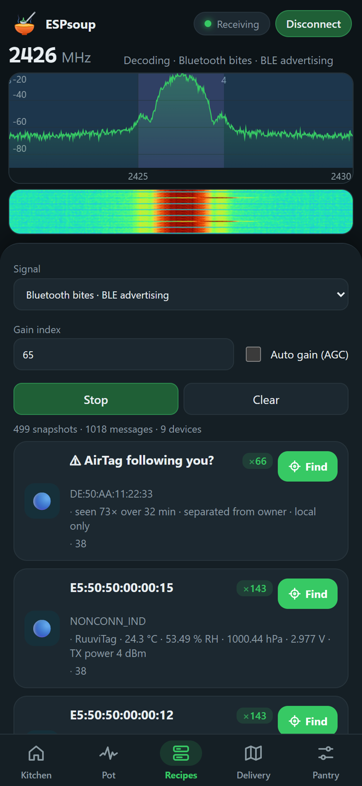
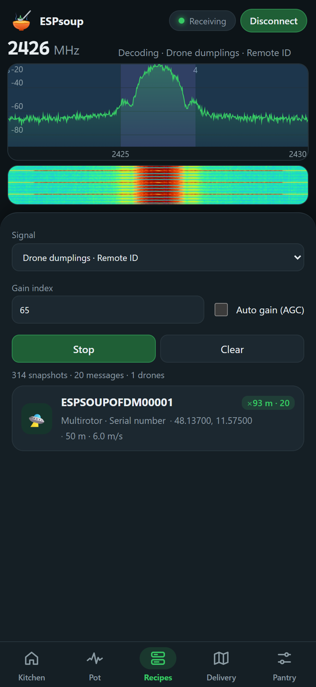
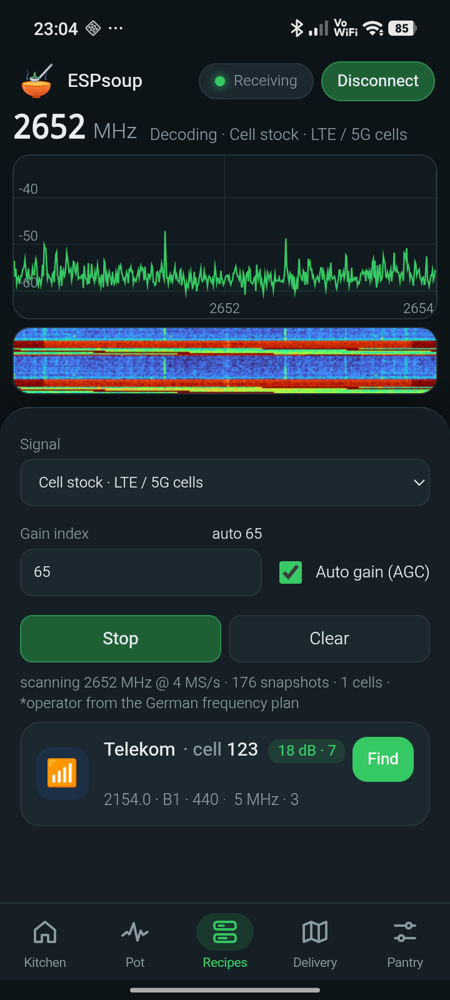
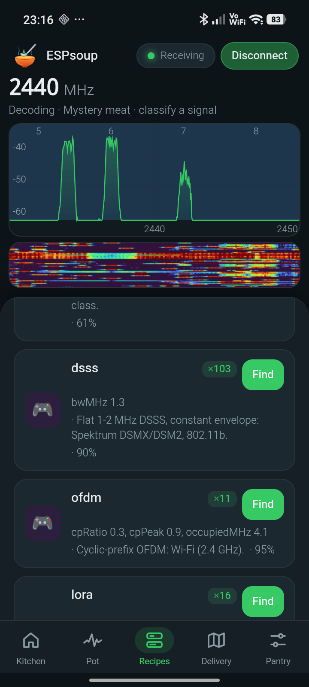
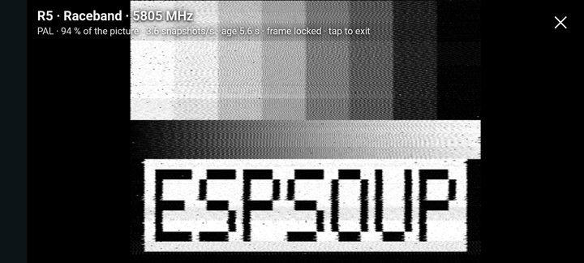

  

<h1 align="center">ESPsoup</h1>

<b>Scoop signals from the frequency soup.</b> 
A receive-only radio scanner app for the ESP32-C5 — Android, Windows and the browser.

<i>🍲 Private preview — not released yet.</i>

  
  
  
  

---

The air around you is a soup of radio signals. ESPsoup turns a cheap **ESP32-C5** board, plugged into your phone or PC by USB,
into a pocket spectrum scanner for the **2.4 GHz and 5 GHz bands**. It shows what's cooking and scoops out whatever it can decode —
Bluetooth, Wi-Fi, Zigbee, Thread, drones, mobile cells, FPV video and more. Everything is decoded locally on your device, and ESPsoup never transmits.

## Screenshots

| Kitchen | Bluetooth + tracker warning | Drone Remote ID |
|---|---|---|
|  |  |  |
| *“Stir the pot” scans every recipe into one dashboard* | *Sensors, beacons and an AirTag “following you?” warning* | *Drone serial number, position, height, speed* |

| Find (hot/cold) | Mobile cells | Signal classifier |
|---|---|---|
|  |  |  |
| *Walk up to one specific device, matched by its ID* | *LTE / 5G cell ID, bandwidth, signal quality* | *“What is this?” — LoRa, FSK, OFDM, radar …* |

| Analog FPV video, assembled from snapshots | Live video (preview of an upcoming feature) |
|---|---|
|  |  |
| *5.8 GHz FPV test picture in fullscreen* | *FM video demodulated on the ESP32 itself, ~25 frames/s* |

Phone screenshots from a Redmi with an ESP32-C5 on USB-OTG. Test signals came from an ADALM-PLUTO signal generator;
device addresses of real neighbours are not shown.

## What works today

Verified over the air with test signals and real devices. Further formats listed in brackets are built in and tested with reference data.

| | Signal | Frequency | What you see |
|---|---|---|---|
| ✅ | Bluetooth LE advertising | 2402 / 2426 / 2480 MHz | names, addresses, manufacturer |
| ✅ | BLE sensors & beacons | 2402 / 2426 / 2480 MHz | BTHome (°C, %RH, battery), iBeacon (+ Xiaomi, Govee, Ruuvi, Eddystone) |
| ✅ | Tracker warning | 2402 / 2426 / 2480 MHz | AirTag / Find My “separated from owner” (+ SmartTag, Tile, Google) — local only |
| ✅ | BLE 2M · extended advertising | 2404–2478 MHz | packets on the secondary channels |
| ✅ | Drone Remote ID | 2402–2480 · 5745 MHz | via Bluetooth, Wi-Fi beacon, Wi-Fi NAN and legacy DJI beacons |
| ✅ | Wi-Fi beacons (802.11b and g) | 2412–2472 MHz | network name, access point, channel, data rate |
| ✅ | Wi-Fi extras | 2412–2472 MHz | ESP-NOW devices, anonymous count of searching phones, deauth-attack alarm |
| ✅ | Zigbee / 802.15.4 | 2405–2480 MHz | network, addresses, Green Power switches |
| ✅ | nRF24 · Hoymiles solar inverters | 2403–2480 MHz | serial number, messages |
| ✅ | ANT+ | 2457 MHz | heart-rate sensors |
| ✅ | LTE / 5G NR cells | 2130–2170 · 2620–2690 MHz | cell ID, bandwidth, operator |
| ✅ | Analog FPV video (PAL / NTSC) | 5650–5745 MHz | channel, standard, fullscreen still picture |
| ✅ | Analog camera finder · microwave oven | 2414–2470 MHz | wireless AV cameras, oven running |
| ✅ | Signal classifier | 2.4 GHz · 5 GHz | LoRa (ExpressLRS, Tracer), Wi-Fi OFDM, DJI video link & DroneID, DVB-T video links, CW / AM / FM / SSB, analog video |
| ✅ | Find | the signal's frequency | hot/cold finder on every result, following one device by its ID |
| ✅ | Spectrum & waterfall | 2130–2730 · 4790–5745 MHz | live view, panorama sweep, Wi-Fi channel view, 24 h band log |
| ◐ | RC links | 2400–2480 MHz | FrSky, FlySky, ELRS FLRC, Spektrum DSMX — detected, exact type not yet reliable |
| ◐ | HDZero / Walksnail, pulsed radar | 5.6–5.9 GHz | detected, type still being tuned |
| ◐ | BLE Coded (long range), Auracast, Thread / Matter | 2.4 GHz | decoders built, packets often longer than one capture |

**Not possible with this chip:** anything below about 2.1 GHz (ADS-B 1090 MHz, GPS, DECT, FM radio, 433/868 MHz sensors, LoRa 868),
2.75–4.79 GHz (5G n78 at 3.5 GHz), and anything above 6 GHz. Following frequency-hopping links, listening to calls
and reading encrypted content are not possible either — by design.

## Coming next

- **Live analog video at ~25 frames/s** and a **continuous Bluetooth packet catcher** (about 100× more packets than today),
  both demodulated directly on the ESP32 — working in the lab, release pending.
- **5.8 GHz upper band and ITS-G5 (5.9 GHz)** reception on supported boards.
- Better identification of RC links (ExpressLRS, FrSky, FlySky, Ghost), Nordic 2 Mbit devices and Bluetooth Classic.
- Public downloads of the Android and Windows apps. Today ESPsoup runs as a web app in Chrome / Edge.

## What you need

Any **ESP32-C5** board works — it is the only ESP32 with the 5 GHz radio ESPsoup needs. Three boards we test with:

|  |  |  |
|:---:|:---:|:---:|
| **Dev board + antenna connector** ⭐ | **Mini · Seeed XIAO ESP32-C5** | **Dev board, PCB antenna** |
| ESP32-C5-WROOM-1U with U.FL — best reception, room for a better 2.4/5 GHz antenna | thumb-sized, U.FL connector — great as a second board | simplest option, fine for the 2.4/5 GHz recipes |
| [View on Amazon](https://www.amazon.de/dp/B0GXVF2MWX?tag=v2x2map-21) | [View on Amazon](https://www.amazon.de/dp/B0HCVKT7GX?tag=v2x2map-21) | [View on Amazon](https://www.amazon.de/dp/B0G2SFD8ZC?tag=v2x2map-21) |

Affiliate links (ad). As an Amazon Associate I earn from qualifying purchases — it costs you nothing extra and keeps the soup cooking.
Product photos come from Amazon.

Also needed:
- A USB-C data cable — plug into the board's **native USB** port. On Android, a USB-OTG cable or adapter.
- The free **ESP-SDR firmware by ESPARGOS**, flashed once with their web installer or from ESPsoup's Pantry.

## Support

ESPsoup is a hobby project. If you like it, a small tip pays for test boards, antennas and coffee:

- ☕ **Ko-fi:** https://ko-fi.com/711it
- 💸 **PayPal:** https://paypal.me/711IT

## Status

Private preview. Nothing is released yet, and a license has not been chosen.

ESPsoup only receives. Rules on receiving radio signals and on what you may do with the information differ between countries — use it responsibly.
ESPsoup is an independent project. It is not affiliated with Espressif Systems or with the ESPARGOS / ESP-SDR project. ESP32 is a trademark of Espressif Systems.
