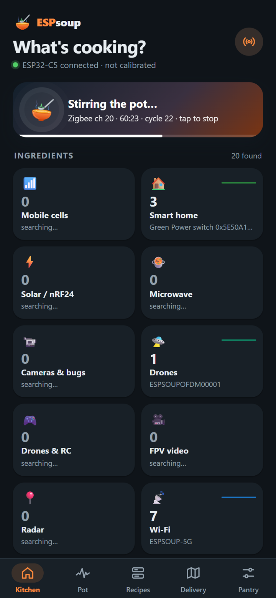
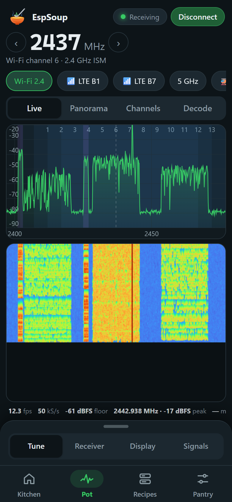
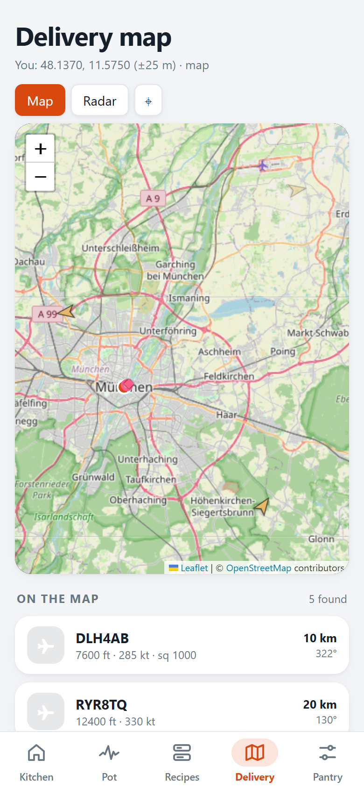
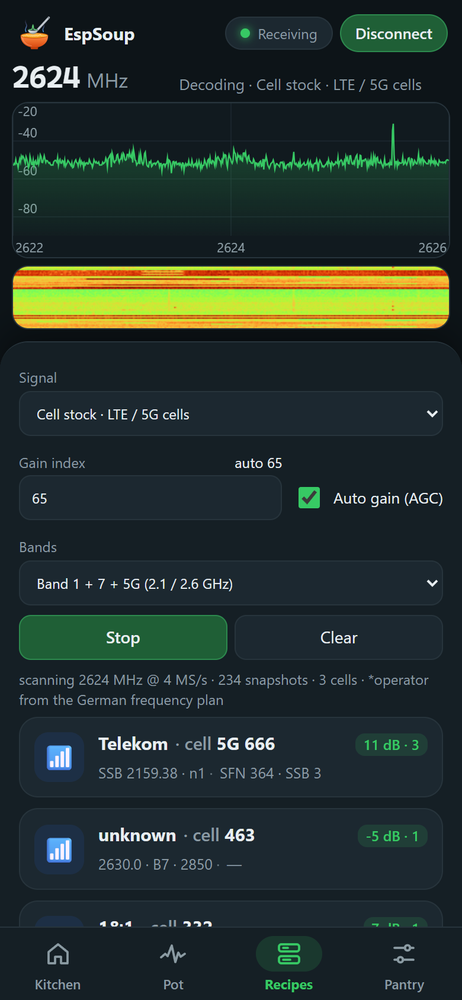
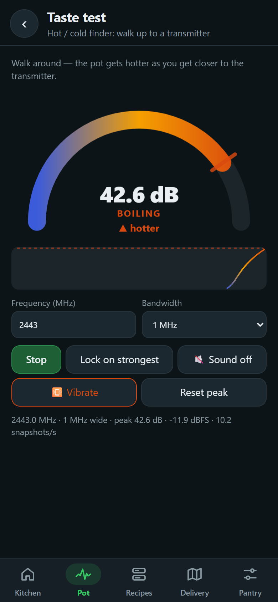
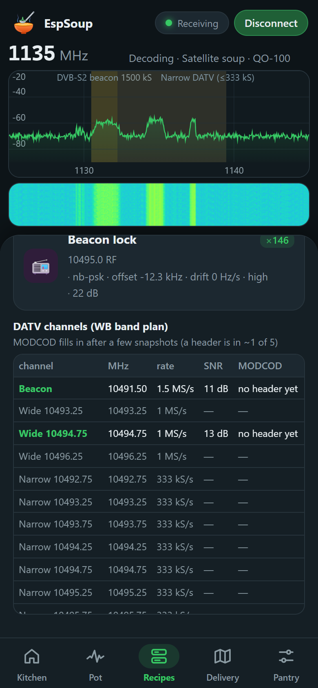
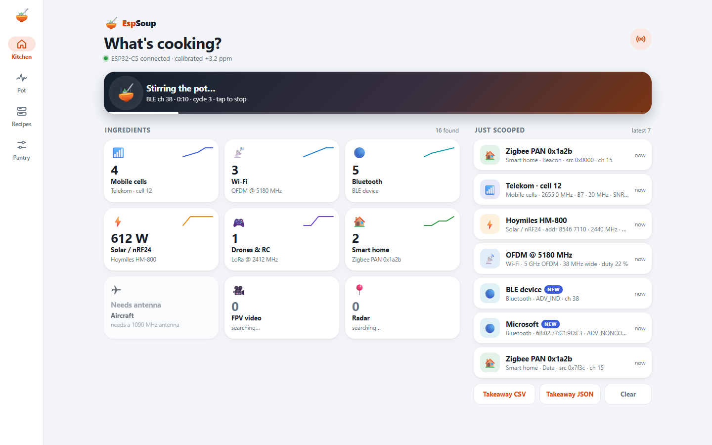

  

<h1 align="center">ESPsoup</h1>

<b>Scoop signals from the frequency soup.</b> 
A receive-only radio scanner app for the ESP32-C5 — Android and desktop browser.

<i>🍲 Work in progress — the source code is not published yet.</i>

---

The air around you is a soup of radio signals. ESPsoup turns a cheap ESP32-C5 board, plugged into your phone or PC by USB,
into a pocket spectrum scanner for **1–6 GHz**. It shows what's cooking and scoops out whatever it can decode.

| Kitchen | Pot | Delivery map |
|---|---|---|
|  |  |  |
| *“Stir the pot” scans and decodes everything* | *Live spectrum and waterfall* | *Aircraft, drones and satellites on a map* |

| Recipes on real air | Taste test | QO-100 |
|---|---|---|
|  |  |  |
| *LTE and 5G cell IDs from a real capture* | *Hot/cold finder for a transmitter* | *Amateur satellite DATV analyser* |

Screenshots marked “real” come from real captures. The others show sample data.

## Planned

- **Kitchen:** a dashboard of everything around you, including Wi-Fi, Bluetooth, mobile cells, smart home, solar inverters, drones and more.
- **Pot:** live spectrum, waterfall, panorama sweeps and Wi-Fi channel view.
- **Recipes:** decoders for BLE, Zigbee, nRF24/Hoymiles, drone Remote ID, Wi-Fi beacons, LTE/5G cell info, DECT, ADS-B and more.
- **Pantry:** frequency calibration against mobile base stations, MQTT export to Home Assistant, and a firmware flasher.
- **Receive only.** ESPsoup never transmits, and it only decodes public broadcast information.

## Status

Private preview. Nothing is released yet, and a license has not been chosen.
ESPsoup is an independent project. It is not affiliated with Espressif Systems or with the ESPARGOS / ESP-SDR project.
